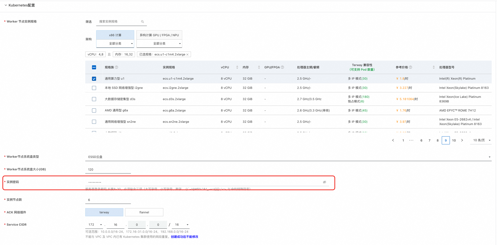
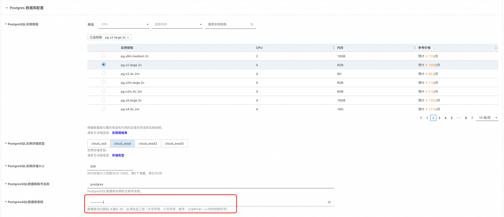
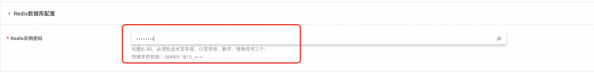
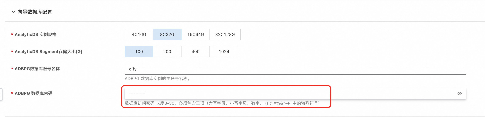
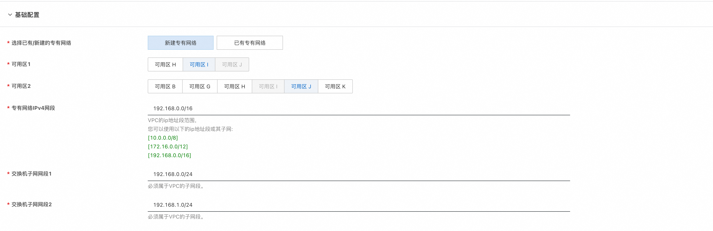

# Dify企业版-计算巢快速部署指南

## 概述

Dify 企业版是一款面向大型组织和团队的私有部署 AI 中间件解决方案，旨在推动企业内部向 AI+ 时代转型。

Dify 采用无代码设计理念，使业务人员能够直接构建和部署 AI 应用，无需深厚的编程知识。 企业版服务配备了强大的管理后台，支持精细化的权限控制和 Workspace 管理，确保团队协作效率和数据安全。同时还提供全面的数据监控服务，助力管理者实时掌握 AI 应用性能和数据使用情况，为决策提供数据支持。

通过私有部署选项和符合企业级安全标准的设计，Dify 企业版在保障数据安全的同时，为组织提供了稳定可靠、可扩展的 AI 基础设施，助力你的企业在 AI 时代保持竞争优势。

本方案提供了在阿里云部署Dify的最佳实践，基于阿里云ACK部署，且同时支持集成云数据库, 可以实现Dify稳定、高性能部署，适用于用于生产环境。


## 资源清单

**按照以下资源配置可以支持每日最多 3000 活跃用户。如果您有更多用户，可以根据需要扩展资源。**

- ACK集群: 6 个工作节点, 每个节点8 CPU，32 GB RAM
- 对象存储 OSS
- Postgres 数据库: 4 CPU，8 GB RAM ,500 GB SSD 存储空间
- Redis 数据库：2 GB RAM
- AnalyticDB PostgreSQL版: 8 CPU，32 GB RAM, 100 GB 存储空间

## 部署流程及部署参数介绍

```
说明：按照上述资源清单中"每日最多 3000 活跃用户"的要求，对资源的规格选择已经设置默认值，只需要设置对应的密码即可，也可根据实际情况修改资源配置。
```

#### Kubernetes集群配置
  
   
   -  选择Worker节点实例规格：默认选择8C32G的规格，ecs.u1-c1m4.2xlarge.
   -  配置Worker节点系统盘类型：系统盘类型默认选择ESSD云盘。
   -  配置Worker节点系统盘大小：系统盘大小默认选择120GB。
   -  配置实例密码：需要用户自行配置。
   -  配置实例节点数：默认选择6个节点，最少不得少于3个节点。
   -  ACK网络插件：默认选择terway，若选择flannel，需额外配置Pod 网络CIDR。
   -  配置集群ServiceCIDR：推荐使用默认值：172.20.0.0/16，也可按需调整。
#### Postgres 数据库配置
  
    - 选择Postgres数据库规格：默认选择4C8G，pg.x2.large.2c
    - 选择Postgres数据库存储类型：默认选择ESSD云盘
    - 配置PostgreSQL实例存储大小：默认选择500GB
    - 配置PostgreSQL数据库账号名称：默认使用"postgres"
    - 配置PostgreSQL实例密码：需要用户自行配置
#### Redis 数据库配置

    - 配置Redis实例密码:需要用户自行配置
#### 向量数据库配置

  - 选择向量数据库规格：默认选择8C32G
  - 配置向量数据库存储大小：默认选择100GB
  - 配置向量数据库账号名称：默认使用"dify"
  - 配置向量数据库实例密码：需要用户自行配置
#### 基础配置

  - 专有网络配置：默认选择创建一个专有网络，
     a) 选择新建专有网络时需要配置专有网络的网段和交换机子网网段
     b) 若选择使用已有专有网络，需额外配置专有网络VPC实例ID和交换机实例ID
  - 可用区选择：为了确保ACK集群的高可用性，这里使用双可用区，需要选择两个可用区

## 验证部署结果

1. 服务实例部署成功大约需要40分钟，请耐心等待。部署完成后，页面上可以看到对应的服务实例。
2. 服务实例详情页可查看Dify的相关信息，根据"Host"配置的提示，在本机配置Host后，即可按照用户手册的步骤使用企业版Dify.
