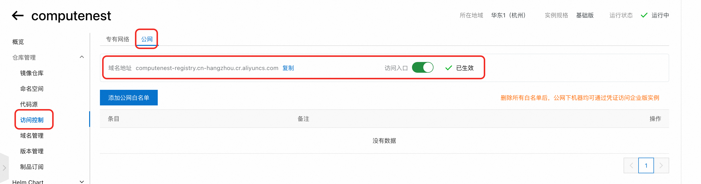

# Dify企业版-计算巢快速部署使用指南

## 概述

Dify 企业版是一款面向大型组织和团队的私有部署 AI 中间件解决方案，旨在推动企业内部向 AI+ 时代转型。

Dify 采用无代码设计理念，使业务人员能够直接构建和部署 AI 应用，无需深厚的编程知识。 企业版服务配备了强大的管理后台，支持精细化的权限控制和 Workspace 管理，确保团队协作效率和数据安全。同时还提供全面的数据监控服务，助力管理者实时掌握 AI 应用性能和数据使用情况，为决策提供数据支持。

通过私有部署选项和符合企业级安全标准的设计，Dify 企业版在保障数据安全的同时，为组织提供了稳定可靠、可扩展的 AI 基础设施，助力你的企业在 AI 时代保持竞争优势。

本方案提供了在阿里云部署Dify的最佳实践，基于阿里云ACK部署，且同时支持集成云数据库, 可以实现Dify稳定、高性能部署，适用于用于生产环境。


## 资源清单

**按照以下资源配置可以支持每日最多 3000 活跃用户。如果您有更多用户，可以根据需要扩展资源。**

- ACK集群: 6 个工作节点, 每个节点8 CPU，32 GB RAM
- 对象存储 OSS
- Postgres 数据库: 4 CPU，8 GB RAM ,500 GB SSD 存储空间
- Redis 数据库：2 GB RAM
- 向量数据库：支持以下两种向量数据库，选择其中一个即可
    1.Tablestore: CU模式（原按量付费），存储弹性，容量无限制
    2.AnalyticDB PostgreSQL版: 8 CPU，32 GB RAM, 100 GB 存储空间

## 前提准备

Dify 企业版需要使用容器镜像仓库来存储和管理插件镜像。 插件本身不是一个 Docker 镜像，而是一个包含插件代码和元数据的压缩包。
当插件部署到 集群时，该压缩包会被构建成 Docker 镜像，因此必须配置容器镜像仓库。

这里以阿里云容器镜像仓库为例介绍准备步骤：
1. 创建一个企业版的容器镜像服务实例，也可以选择已有的容器镜像服务实例。
   
2. 配置容器镜像仓库的访问控制，给实例打开公网访问，记录公网访问的endpoint,如果使用内网访问，需要在访问控制中添加相应"专有网络"的白名单
   
3. 创建存储插件的命名空间，配置"自动创建仓库"，并配置仓库类型为公开，并记录命名空间的名称。
   
4. 设置容器镜像仓库的访问凭证，设置固定密码，并记录固定密码
   
5. 记录容器镜像仓库的访问用户名，如下图中所示，记录username后的数据
   

## 部署流程及部署参数介绍

```
说明：按照上述资源清单中"每日最多 3000 活跃用户"的要求，对资源的规格选择已经设置默认值，只需要设置对应的密码即可，也可根据实际情况修改资源配置。
```

#### Kubernetes集群配置
  
   
   -  选择Worker节点实例规格：默认选择8C32G的规格，ecs.u1-c1m4.2xlarge.
   -  配置Worker节点系统盘类型：系统盘类型默认选择ESSD云盘。
   -  配置Worker节点系统盘大小：系统盘大小默认选择120GB。
   -  配置实例密码：需要用户自行配置。
   -  配置实例节点数：默认选择6个节点，最少不得少于3个节点。
   -  ACK网络插件：默认选择terway，若选择flannel，需额外配置Pod 网络CIDR。
   -  配置集群ServiceCIDR：推荐使用默认值：172.20.0.0/16，也可按需调整。
#### Postgres 数据库配置
  
  - 选择Postgres数据库规格：默认选择4C8G，pg.x2.large.2c
  - 选择Postgres数据库存储类型：默认选择ESSD云盘
  - 配置PostgreSQL实例存储大小：默认选择500GB
  - 配置PostgreSQL数据库账号名称：默认使用"postgres"
  - 配置PostgreSQL实例密码：需要用户自行配置
#### Redis 数据库配置

  - 配置Redis实例密码:需要用户自行配置
#### 向量数据库配置

  - 向量数据库支持选择“使用TableStore做向量数据库”和“使用AnalyticDB PostgreSQL做向量数据库”
  - 当选择TableStore时，实例名称采取默认生成的即可，TableStore默认多 AZ 容灾
    
  - 选择AnalyticDB PostgreSQL时，配置以下参数
    
  - 选择向量数据库规格：默认选择8C32G
  - 配置向量数据库存储大小：默认选择100GB
  - 配置向量数据库账号名称：默认使用"dify"
  - 配置向量数据库实例密码：需要用户自行配置
#### 容器镜像仓库配置

- 配置容器镜像仓库的前缀,取准备步骤中记录的容器镜像仓库的endpoint和命名空间名称，格式为：{endpoint}/{namespace}
- 配置访问容器镜像仓库的用户名：取准备步骤中记录的容器镜像仓库的访问用户名
- 配置访问容器镜像仓库密码：取准备步骤中记录的容器镜像仓库的密码
#### 基础配置

  - 专有网络配置：默认选择创建一个专有网络，
     a) 选择新建专有网络时需要配置专有网络的网段和交换机子网网段
     b) 若选择使用已有专有网络，需额外配置专有网络VPC实例ID和交换机实例ID
  - 可用区选择：为了确保ACK集群的高可用性，这里使用双可用区，需要选择两个可用区

## 验证部署结果

1. 服务实例部署成功大约需要40分钟，请耐心等待。部署完成后，页面上可以看到对应的服务实例。
2. 服务实例详情页可查看Dify的相关信息，根据"Host"配置的提示，在本机配置Host后，即可按照用户手册的步骤使用企业版Dify.


## 升级指南

部分没有兼容问题的版本可以在计算巢一键升级，若两个版本间存在Non-skippable的版本，或者存在兼容问题，推荐手动升级。

Dify-Helm-Release: https://langgenius.github.io/dify-helm/#/

### 方式一：在计算巢一键升级
**注意**：如果手动修改过集群中helm values等配置，在计算巢一键升级后，会覆盖手动修改的配置。
1. 登录计算巢控制台，找到对应服务实例，点击"升级服务实例"
   

### 方式二：登录到集群中手动升级
1. 登录到计算巢控制台，找到对应的服务实例，在资源中找到ACK集群，跳转到ACK控制台

2. 在ACK控制台获取到对应的KubeConfig, 配置到本地或远程机器上，通过kubectl 连接 Kubernetes 集群

3. 添加helm仓库信息
   `helm repo add dify https://langgenius.github.io/dify-helm
   `
   `helm repo update
   `
4. 导出当前生效的helm values
`helm get values ack-dify -n dify-system -o yaml > current-values.yaml
`
5. 更新helm values的配置：
    将上个步骤中获取的current-values.yaml中的内容相比要升级的chart版本进行更新，主要是更新image的配置。 可以diff下两个版本之间的values.yaml，将current-values.yaml中的image配置更新为要升级的chart版本对应的image配置，
    比如当前current-values.yaml中需要更新的部分内容如下：
    
**注意**：
   - 需要更新current-values.yaml文件中所有的需要更新的镜像配置，否则升级后还是会使用老版本的镜像。
   - values.yaml中默认使用的repository：langgenius, 在国内地域可能会拉不下来，可以使用仓库g-hsod9681-docker.pkg.coding.net
6. 执行升级操作，version为要升级的chart版本
`helm upgrade ack-dify -f curent-values.yaml -n dify-system dify/dify --version 3.7.3`
7. 升级失败后，如果要回滚到老版本，可以回滚到上一版本
   `helm rollback ack-dify -n ack-system`
